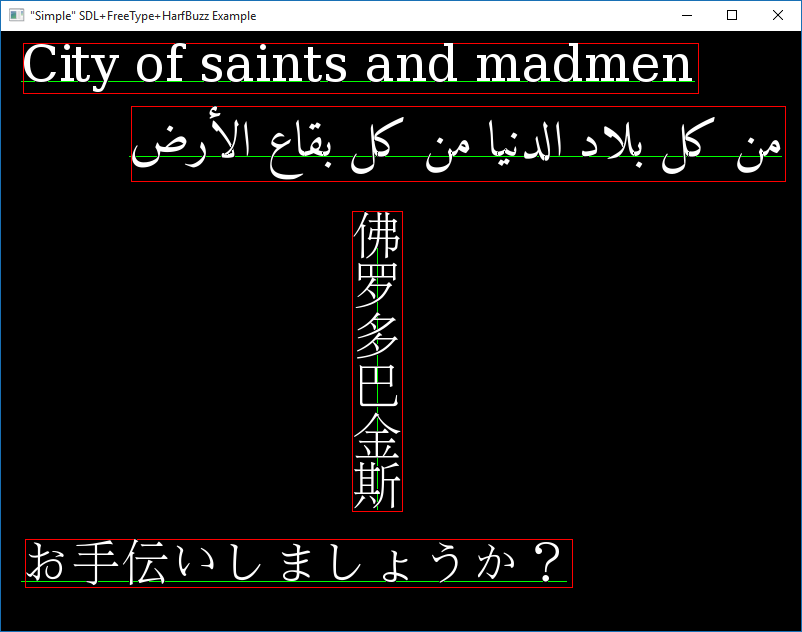

A simple application to render unicode text using harfbuzz, freetype and SDL, 
with a Visual Studio 2015 solution and pre-built libraries.

Based on and forked from the following repositories:
* https://github.com/anoek/ex-sdl-cairo-freetype-harfbuzz
* https://github.com/lxnt/ex-sdl-freetype-harfbuzz
* https://github.com/UnickSoft/ex-sdl-freetype-harfbuzz-fribidi.git

My example doesn't use FriBidi or Cairo, and utilizes FT_Render_Glyph for rendering
instead of using spanners and FT_Outline_Render. It was mainly motivated by the desire
to add complex script support to the [XD Framework](https://github.com/firas-assaad/xd) without
introducing any big dependencies.

Screenshot
==========

